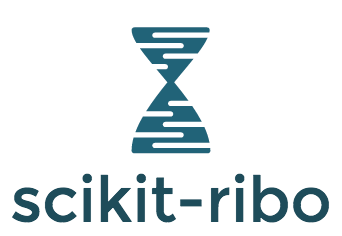

## *scikit-ribo*

#### - Accurate inference and robust modelling of translation dynamics at codon resolution with Riboseq data
#### https://github.com/hanfang/scikit-ribo

|build-status| |docs|

--------

## Contact

#### Han Fang
#### Stony Brook University & Cold Spring Harbor Laboratory
#### Email: hanfang.cshl@gmail.com

## Requirement: 
#### Environment: Python3, Linux

Recommend setting up your environment with [Conda](https://conda.io/docs/intro.html)

#### Dependencies:

| Dependencies | Version >= |
| ------------- |:-------------:|
| bedtools | 2.26.0 |

When using `pip install scikit-ribo`, all the following dependencies will be pulled and installed automatically.

| Python package| Version >= |
| ------------- |:-------------:|
| colorama | 0.3.7 |
| glmnet-py | 0.1.0b |
| gffutils | 0.8.7.1 |
| matplotlib | 1.5.1 |
| numpy | 1.11.2 |
| pandas | 0.19.2 |
| pybedtools | 0.7.8 | 
| pyfiglet | 0.7.5 | 
| pysam | 0.9.1.4 |
| scikit-learn | 0.18 |
| scipy | 0.18.1 |
| seaborn | 0.7.0 |
| termcolor | 1.1.0 |

## Install

To install `scikit-ribo`, simply use the below command
    
    pip install scikit-ribo
    
## How-to-use

Twp steps:

- Build index: `scikit-ribo-build.py`

- Fit model:   `scikit-ribo-run.py`

## Usage

1. Build index: `scikit-ribo-build.py`


    ```
    scikit-ribo-build.py -g gtf-file -f fasta-file -p prefix -r rna-fold-folder -t TPM-file -o index-path

    required arguments:
    -g G        Gtf file, required
    -f F        Fasta file, required
    -p P        Prefix to use, required
    -r R        Rnafold folder, required
    -t T        TPM of RNAseq sample, required
    -o O        Output path of the built indexes, required
    ```


2. Fit model:  `scikit-ribo-run.py`

    ```
    scikit-ribo-run.py -i bam-file -f index-path -p prefix -o output-path

    required arguments:
    -i I        Input bam file
    -f F        path to the Folder of BED/index files generated by the pre-processing module
    -p P        Prefix for BED/index files
    -o O        Output path, recommend using the sample id

    optional arguments:    
    -h, --help  show this help message and exit
    -q Q        minimum mapQ allowed, Default: 20
    -s S        Shortest read length allowed, Default: 10
    -l L        Longest read length allowed, Default: 35
    -c          enable cross validation for glmnet
    -r          setting this flag will enable the RelE mode
    -u U        Un-mappable regions
    ```
For more information, please refer to the [template shell script](https://github.com/hanfang/scikit-ribo/blob/master/test/run_scikit_ribo.sh) about details of executing the two modules.

## Introduction

Scikit-ribo has two major modules: Ribosome A-site location prediction, and translation efficiency (TE) inference using a penalized generalized linear model (GLM). 

A complete analysis with scikit-ribo has two major procedures: 
1) data pre-processing to prepare the ORFs, codons for a genome: `scikit-ribo-build.py`
2) the actual model training and fitting: `scikit-ribo-run.py`

Inputs:
1) The alignment of Riboseq reads (bam)
2) Gene-level quantification of RNA-seq reads (from either Salmon or Kallisto)
3) A gene annotation file (gtf)
4) A reference genome for the model organism of interest (fasta)

Outpus:
1) Translation efficiency estimates for the genes
2) Translation elongation rate for 61 sense codons
3) Ribosome profile plots for each gene
4) Diagnostic plots of the models

## Reference

Fang et al, "Scikit-ribo: Accurate inference and robust modelling of translation dynamics at codon resolution" (Preprint coming up)
